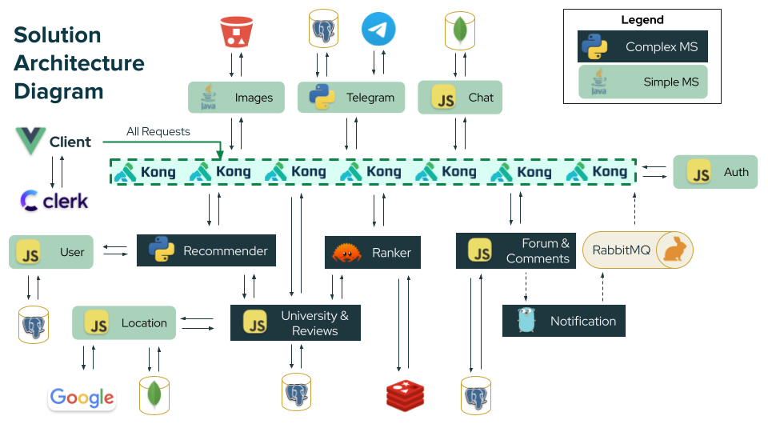

  

# Uniexplorers (Backend)

Exchange, for everyone

IS213 Enterprise Solution Development G1T1

# Contents

1. [Project Overview](#project-overview)
2. [Technical Overview](#technical-overview)
3. [Technologies Utilised](#technologies-utilised)
4. [Getting Started](#getting-started)
5. [Contributors](#contributors)

# Project Overview

### Uniexplorers is
- A one-stop shop for exchange-related information
- A social network connecting incoming, interested and alumni exchangers
- A travel guide and planner for students heading on exchange
- An intelligent university recommender, based on your preferences

# Technical Overview

  

# Technologies Utilised

  <h3>Libraries</h3>
  
<strong>Web Services and User Interface</strong>

  
  
  
  
  
  

  

  
<strong>API Gateway</strong>

  
  
  
<strong>Deployment (Development & Production)</strong>

  
  

  
<strong>Machine Learning</strong>

  
  

  
<strong>AMQP</strong>

  

  
<strong>Authentication</strong>

  

  
<strong>Databases</strong>

  
  
  

  <h3>Languages</h3>
  
  
  
    

# Getting Started

## `docker-compose` deployment

### Bringing services up

`docker-compose up -d --build` should be sufficient.

### Bringing services down

`docker-compose down` to simply bring services down.

`docker-compose down -v` to purge databases and volumes. Necessary if schemas change.

## `k8s` deployment

Please see [k8s/README.md](./k8s/README.md).

## Deployment Process Overview

1. Databases are brought up
    - `forum_db`, `uni_db`, `user_db` - PostgreSQL databases
    - `mongodb` - MongoDB database
2. Database seeding and migration as necessary. These run independently from each other.
    - For PostgreSQL databases:
      1. `seed_migration` runs, setting up database schema and populating initial seed data
      2. `ingestion` runs, automatically cleaning scraped course mapping data and inserting the data into the DB
    - For MongoDB databases
      1. `mongoseed` runs, inserting the respective `course_mapping` JSON and `nearby`/`geocode` JSONs. JSON files are automatically chunked to not exceed 16MB in size.
3. Simple microservices are brought up.
4. Complex microservices that rely on the simple microservices are brought up.
5. Kong is brought up to enable microservice access via API Gateway.

# API Documentation

[Documentation hosted on `bump.sh`](https://bump.sh/uniexplorers/doc/api)

# Contributors

  
  <h4>L-R: TOH Zheng Feng, Darryl POH Cheng Yew, Jared Marc SONG Kye-Jet, LIM Jing Jie, Isabelle SEET Yu Fei, Akeela Darryl FATTHA</h4>

